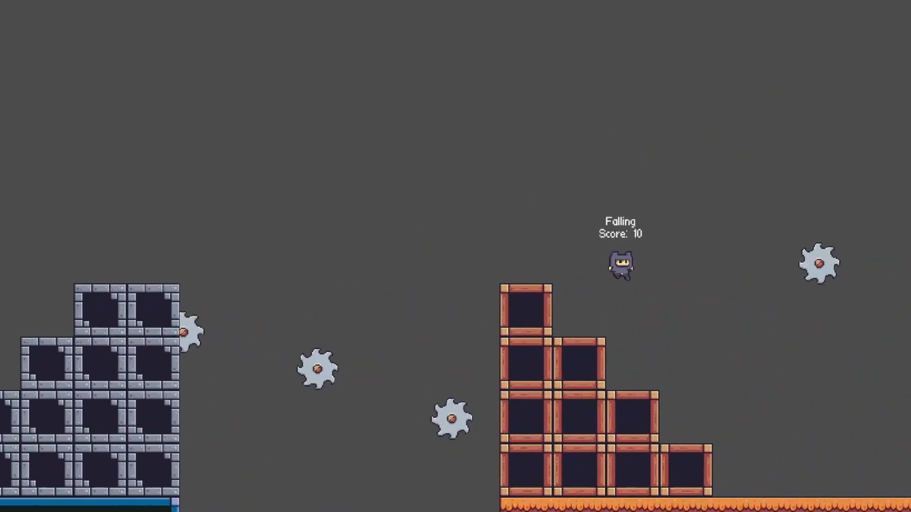

# 🎮 Godot 4 Platformer Template by CodeKokeshi

Welcome to **Godot 4 Platformer Template**, a feature-packed starting point for creating 2D platformer games. Currently a **Work in Progress**, this template provides smooth physics, engaging mechanics, and visually appealing assets for aspiring developers.

---

## 🌟 Features
- **Core Mechanics:**
  - 🚂 Double Jump
  - 🚷 Wall Sliding
  - ⚡ Dashing
- **Player Interactions:**
  - 🏃 Smooth Physics
  - 🎮 Animation State Text
  - 🔑 Collectibles
- **Immersive Gameplay:**
  - 😿 Spawning & Dying Animations
  - 🚱 Various Obstacles
- **Custom Assets:**
  - 🎨 Heavily Modified PixelFrog Assets (Based on [PixelAdventure by PixelFrog](https://pixelfrog-assets.itch.io/pixel-adventure-1))

---

## 🚀 Tools Used
- **[Piskel](https://www.piskelapp.com/)** - Pixel Art Creation
- **[Audacity](https://www.audacityteam.org/)** - Audio Editing
- **[Godot Engine](https://godotengine.org/)** - Game Development

---

## 🔨 To-Do List
- 🦊 Add Fighting Mechanics
- 👹 Add Enemies
- 🔖 Implement Checkpoints
- 🔮 And much more!

---

## 📜 Credits
- **Pixel Art:** [PixelAdventure by PixelFrog](https://pixelfrog-assets.itch.io/pixel-adventure-1)
- **Pixel Font:**[at01 Pixel Font by GrafxKid](https://itch.io/queue/c/733269/godot-pixel-fonts?game_id=707314)
- **Development:** CodeKokeshi

---

## 💬 Feedback & Contributions
Have suggestions or want to contribute? Feel free to open an issue or submit a pull request. Let’s make this template even better together!

---

## 🌈 Sneak Peek

---
