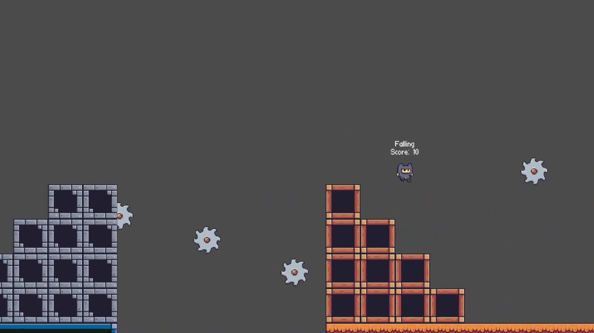

# 🎮 Godot 4 Platformer Template by CodeKokeshi

Welcome to **Godot 4 Platformer Template**, a simple starting point for creating 2D platformer games. This template is designed to be easy to use and customize for your own projects.

---

## 🌟 Features

### ⚙ Core Mechanics
- **Jumping:** Single jump, double jump, coyote time, and jump buffering for smooth platforming.
- **Wall Interactions:** Wall sliding and wall jumping for more movement options.
- **Dashing:** Quick bursts of speed for dynamic gameplay.

### 🔍 Player Interactions
- **Animations:**
  - Idle, running, wall sliding, dashing, and other movement animations.
  - Appearing and disappearing animations for transitions.
  - Death animation when hitting obstacles.
- **Checkpoints:**
  - Activated and Not Set states are shown with labels.
  - Respawning mechanics bring the player to the last checkpoint.
- **Collectibles:** A template for items (e.g., bananas) that increase the player’s score.
- **Obstacles:**
  - Templates for hazards like spinning saws that cause player death and respawn.

### 🎨 Custom Assets
- Basic tilesets for ground, walls, and ceilings with tilesetting support.
- Custom background music with looping support.

---

## 🚀 Tools Used
- **[Piskel](https://www.piskelapp.com/):** For pixel art.
- **[Audacity](https://www.audacityteam.org/):** For audio editing.
- **[Godot Engine](https://godotengine.org/):** For game development.

---

## 🔧 To-Do List
- Add AI-driven enemies.
- Create more complex levels and environmental challenges.
- Add more player movements.
- Add physics-based objects.
- Add dialogue and quest systems.
- Add combat mechanics.

---

## 📜 Credits
- **Pixel Art:** [PixelAdventure by PixelFrog](https://pixelfrog-assets.itch.io/pixel-adventure-1)
- **Pixel Font:** [at01 Pixel Font by GrafxKid](https://grafxkid.itch.io/at01-pixel-font)
- **Development:** [CodeKokeshi](https://github.com/CodeKokeshi)

---

## 💬 Feedback & Contributions
If you have suggestions or want to contribute, feel free to open an issue or submit a pull request.

---

## 🌍 Sneak Peek

---
